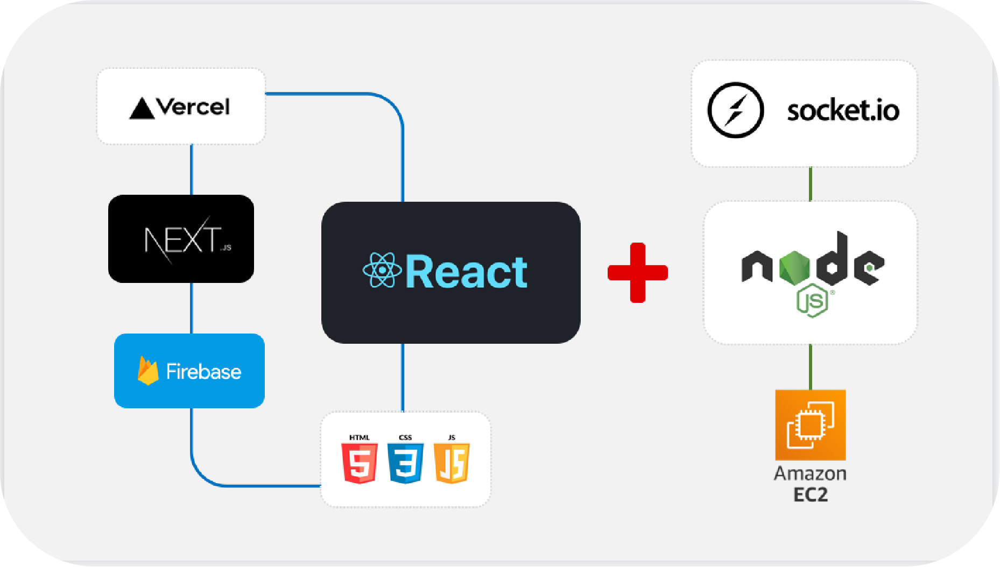
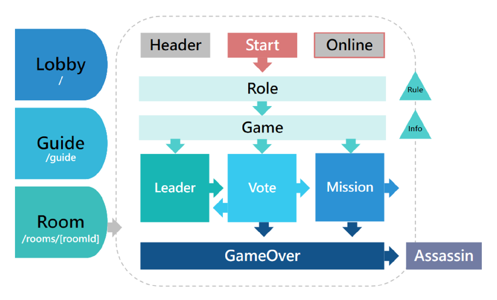

## Introduction

復刻經典桌遊阿瓦隆，期待作為團康輔助工具，好友相約，隨時玩樂！

## Architecture

前端以 React 作為主要框架，搭配 Next.js，於 Vercel 部屬。  
後端以 node.js 架設伺服器，提供 socket.io 互動功能，部屬於 AWS EC2。

## Components

- 頁面：登入頁面 Lobby、遊戲說明 Guide、遊戲房間 Room  
- 房間：房間標頭 Header、在線人員 OnlineUsers  
- 流程：抽取角色 Role、<b>流程串接 Game</b>、遊戲結束 GameOver  
- 任務：隊長選人 Leader、全員投票 Vote、執行任務 Mission、刺客行動 Assassin  
- 資訊：遊戲規則 GameRule、遊戲紀錄 GameInfo

 

## Tip
- 依玩家人數變動的角色人數、任務次數，以物件列表配置。
- 運用 條件表達式 取代非必要的 state 和監聽。
- 使用 useEffect 時善用 if 控制。
- 放棄 state 改用單純的 display 處理 GameOver 的畫面清理

## Note
- react 和 socket.io 搭配時，須留意 render 和 同步異步 的狀況。
- socket.io 針對特定對象的傳訊，程式碼須於加入房間的 emit 位置做監聽。
- 載入頁面即掛載的監聽，無法讀取 state 的資料。
- next.js 動態路由 run build 後 404 的狀況。
- 遊戲即時且臨時的資料存放思考。

