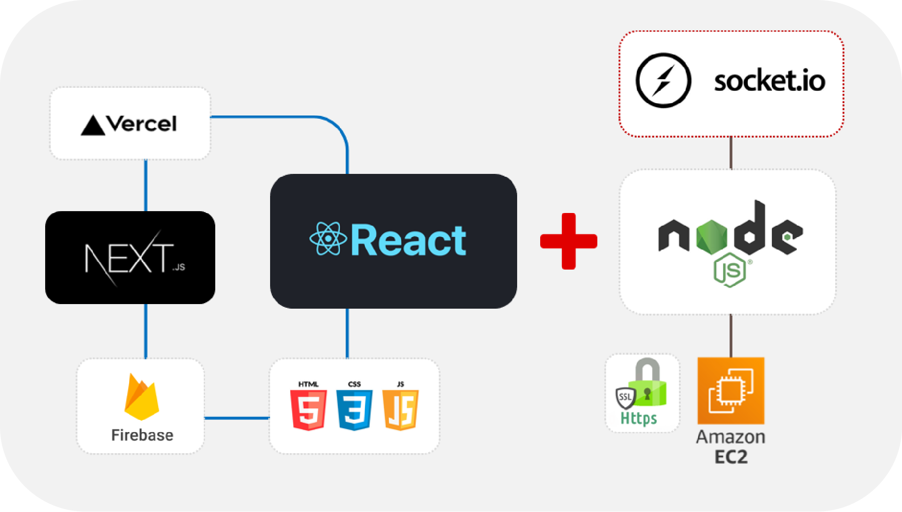

## Introduction

復刻經典桌遊阿瓦隆（可以簡單理解為在玩家中找出隱藏壞人的遊戲），  
期待網站能作為簡易的團康輔助工具，好友相約，隨時玩樂！  

遊戲 DEMO 影片：https://www.flexclip.com/tw/share/27031520f008021fd06997fd2f342bffffeaf8e.html

 

## Architecture

前端以 React 作為主要框架，搭配 Next.js，於 Vercel 部屬。  
後端由 node.js 架設伺服器，以 socket.io 提供互動功能，部屬於 AWS EC2。

## Components

 

#### 遊戲環節

- <b>抽取角色 Role 組件</b>，依玩家人數提供對應的好人壞人卡牌數量，  
並在任一玩家點選後將資料提供後端作角色標識，並即時同步移除該角色牌卡。
  
- <b>隊長提名 Leader 組件</b>，依參與人員亂序產生隊長列表，  
依遊戲進度將組件顯示於當次擔任隊長的玩家頁面，使其能選擇欲進行任務的人員。

- <b>全員投票 Vote 組件</b>，隊長提名後，觸發所有人的頁面執行投票環節，以多數決判定是否出任務，  
若平票或反對票佔多數，則出現電池按鈕以標記投票失敗次數，並更換隊長重新選派。

- <b>執行任務 Mission 組件</b>，投票同意後，觸發隊長選定人員的頁面執行任務環節，  
若有一人選擇任務失敗，則該次任務失敗，註記於任務紀錄板上，並重啟隊長環節。

- <b>遊戲結束 GameOver 組件</b>，若任務失敗三次，或連續投票失敗五次，  
渲染全員畫面為壞人陣營獲勝；若任務成功三次，渲染為刺客畫面，並依刺殺結果再次渲染。

- <b>刺客行動 Assassin 組件</b>，若任務成功三次，依據角色標識，呈現組件給刺客玩家。

#### 流程串接

- <b>路由部分</b> 由 登入頁面 Lobby、遊戲說明 Guide、遊戲房間 Room 組成。  
結合 FireBase 做房間資料的儲存管理，並依房間 id 創建動態路由的遊戲空間。

- <b>在線人員 OnlineUsers 組件</b>，呈現在線人員狀態，並監控玩家中途離場時，應觸發遊戲中止。

- <b>流程串接 Game 組件</b>，天黑閉眼語音環節、遊戲開始前的規則提醒，  
socket.io 監聽掛載、觸發不同環節的遊戲組件、無活動進行之等候頁面、隊長重啟前的各項資料清除等。

